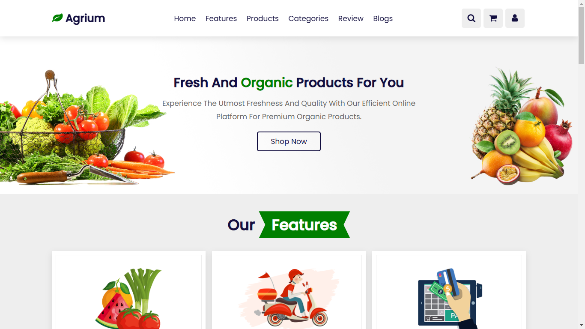
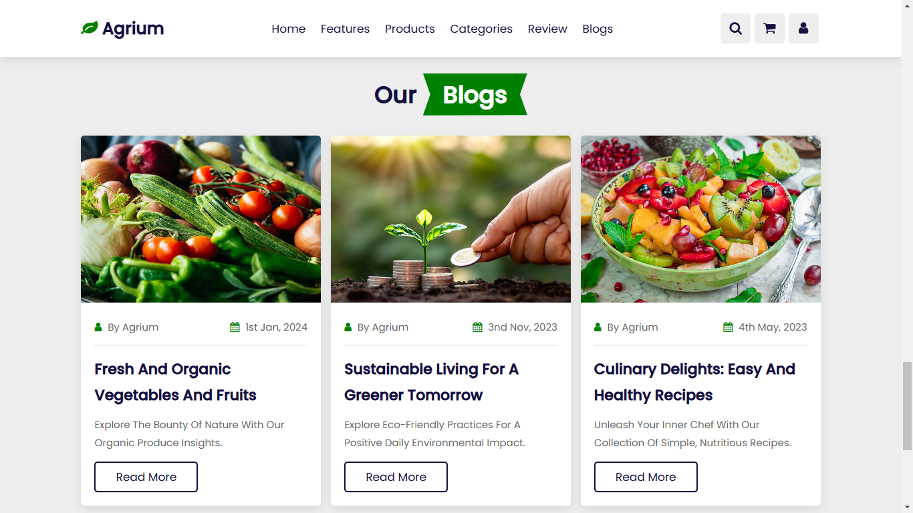

# Agrium 🌿

Agrium is a modern organic products website built using **HTML, CSS, and JavaScript**. It provides a seamless shopping experience for eco-friendly and sustainable products. 🌱💚

## 🌟 Features
- 🏡 **Home** - Welcome section with an overview of Agrium.
- 🚀 **Features** - Highlights of our organic products.
- 🛒 **Products** - Explore a variety of eco-friendly goods.
- 📂 **Categories** - Browse products by categories.
- ⭐ **Reviews** - Customer feedback and testimonials.
- 📝 **Blogs** - Read articles on sustainability and organic living.

## 📸 Screenshots



## 🚀 Installation
1. Clone the repository:
   ```sh
   git clone https://github.com/lakshithamadumal/Agrium.git
   ```
2. Open the `index.html` file in your browser.

## 🛠️ Technologies Used
- HTML5
- CSS3
- JavaScript

## 📬 Contact
For any inquiries or collaborations, feel free to reach out!

🌍 Live Demo: [Add your live link here]

📧 Email: mandujayaweera2003@gmail.com

---
🌱 *Agrium - Supporting a greener world!* 🌍💚
